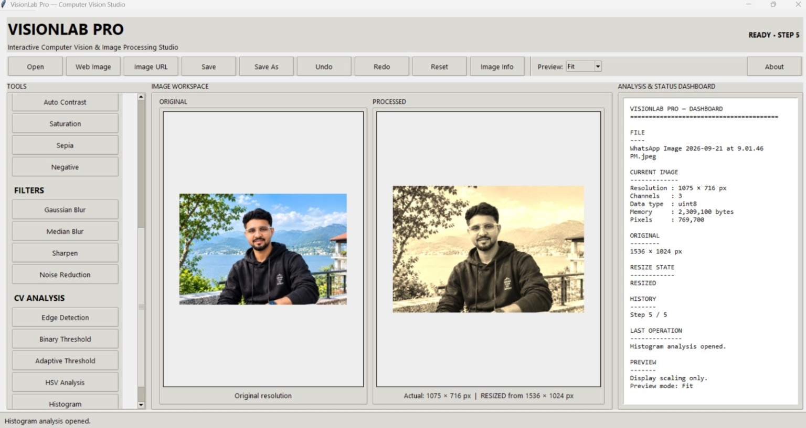
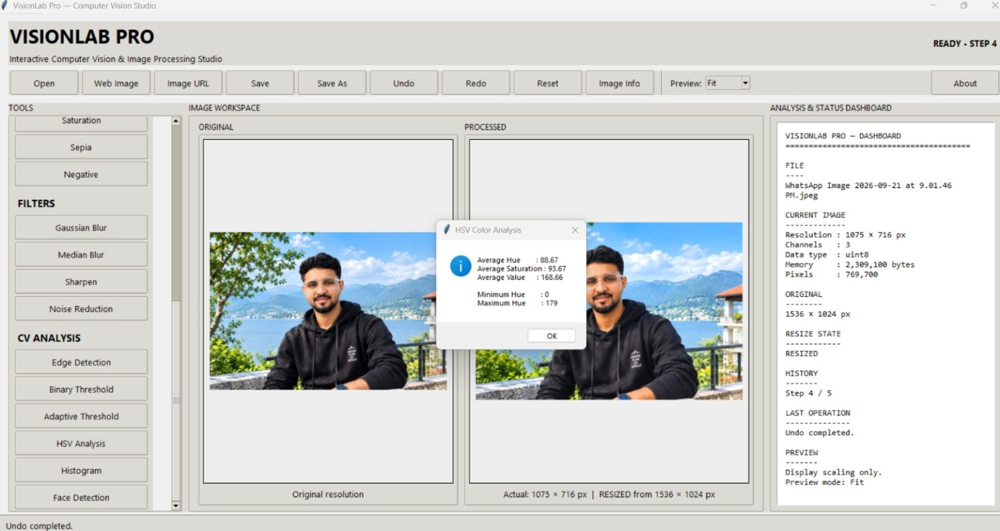
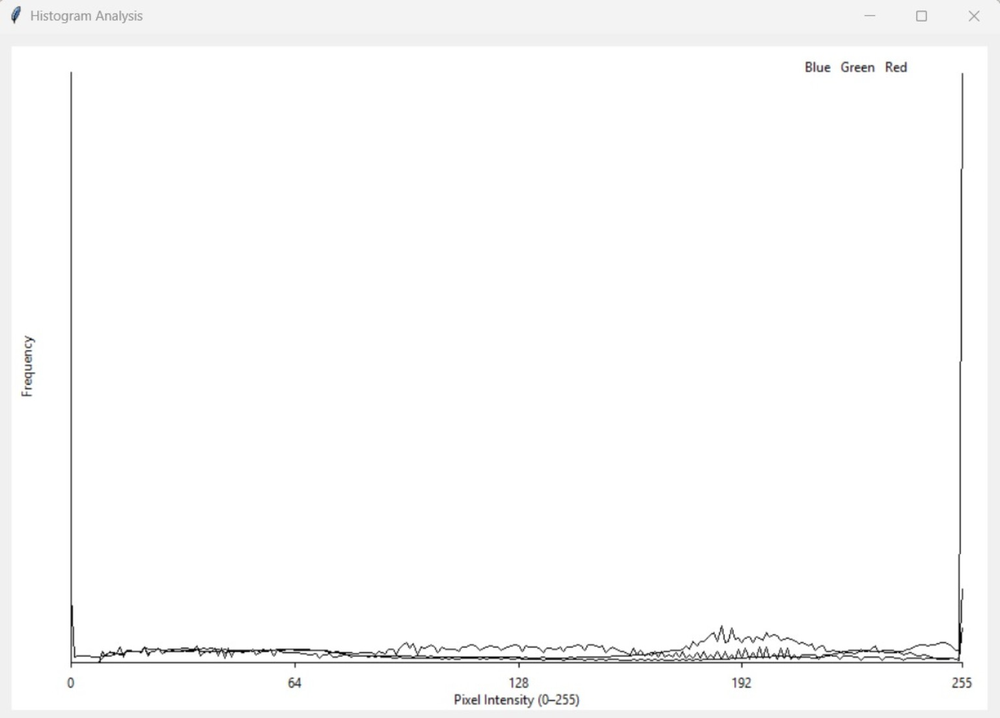
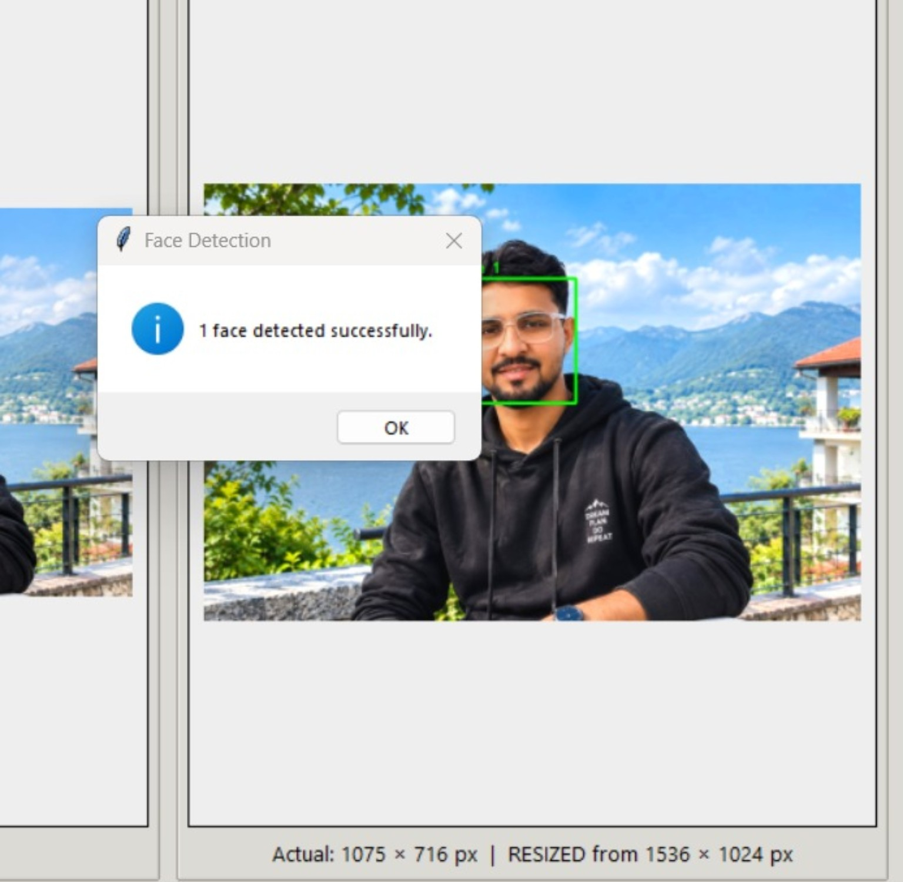
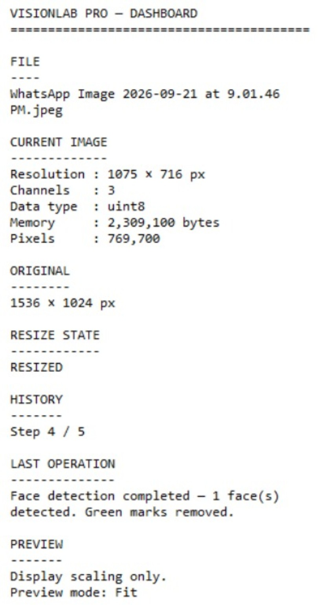

# VISIONLAB PRO

### Interactive Computer Vision & Image Processing Studio

VisionLab Pro is a Python desktop application built with OpenCV and Tkinter for practical image processing and computer-vision experimentation in a clean, interactive interface.



## ✨ Features

### 🖼️ Image Workflow
- Open local images
- Load images from direct URLs
- Search and load web images
- Original vs processed image workspace
- Preview scaling: Fit / 50% / 75% / 100%
- Image information dashboard

### 🎨 Light & Color
- Grayscale
- Brightness
- Contrast
- Auto Contrast
- Saturation
- Sepia
- Negative
- Colorize / pseudo-color mapping

### 🔧 Filters & Transformations
- Gaussian Blur
- Median Blur
- Sharpen
- Noise Reduction
- Resize
- Center Crop
- Rotate 90° / 180°
- Horizontal / Vertical Flip

### 🔬 Computer Vision Analysis
- Edge Detection
- Binary Threshold
- Adaptive Threshold
- HSV Color Analysis
- Histogram Analysis
- Haar Cascade Face Detection

### ⚡ Workflow Features
- Undo / Redo history
- Reset processing
- Safe direct saving to a `Screenshots` folder
- Save As with multiple image formats
- Keyboard shortcuts
- Responsive web-image loading
- Temporary face-detection annotations that are not retained in the processed image

## 📸 Screenshots

### Main Interface


### HSV Color Analysis


### Histogram Analysis


### Face Detection


### Analysis Dashboard


## 🚀 Installation

Python 3.10+ is recommended.

```bash
git clone https://github.com/mohitsonawane21/VisionLab-Pro.git
cd VisionLab-Pro
python -m pip install -r requirements.txt
python program1.py
```

Tkinter is included with standard Python installations on Windows. If your Python distribution does not include Tkinter, install the appropriate Tk package for your platform.

## ⌨️ Keyboard Shortcuts

| Shortcut | Action |
|---|---|
| `Ctrl + O` | Open image |
| `Ctrl + S` | Safe direct save |
| `Ctrl + Shift + S` | Save As |
| `Ctrl + Z` | Undo |
| `Ctrl + Y` | Redo |
| `Ctrl + R` | Reset |

## 💾 Saving Behavior

`Ctrl + S` / **Save** uses a dedicated `Screenshots` folder and avoids overwriting the original image. **Save As** lets you choose the destination and supported image format.

## 🌐 Web Image Support

The Web Image workflow can search Openverse and Wikimedia Commons, display thumbnails, and load selected results. Image URLs can also be loaded directly when the source permits automated access.

Some websites may block automated requests, require JavaScript, login, or anti-bot verification; those limitations depend on the source website.

## 🎨 Colorize vs Original Color Recovery

The **Colorize Image** feature creates a pseudo-color representation from luminance/intensity information. It does not reconstruct the original real-world colors of a grayscale image.

## 🧠 Face Detection

Face detection uses OpenCV's Haar Cascade classifier. Detection annotations are presented temporarily for analysis and are not intended to become part of the saved processed image.

## 🛠️ Tech Stack

- Python
- OpenCV
- NumPy
- Pillow
- Tkinter
- Matplotlib
- Requests

## 📁 Project Structure

```text
VisionLab-Pro/
├── program1.py
├── README.md
├── requirements.txt
├── LICENSE
├── .gitignore
└── screenshots/
    ├── main-dashboard.jpg
    ├── hsv-analysis.jpg
    ├── histogram-analysis.jpg
    ├── face-detection.jpg
    └── analysis-dashboard.jpg
```

## 📌 Project Purpose

VisionLab Pro demonstrates practical image-processing and computer-vision concepts through an interactive desktop workflow. It is suitable as a learning project, academic demonstration, or portfolio project for Python and OpenCV development.

## 📄 License

Released under the MIT License.
